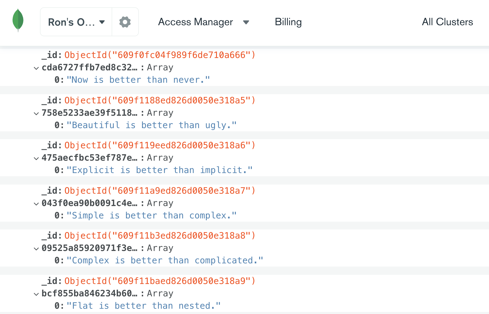

# Hash-Service 
## Kindur message encryption api
Encryption and decryption API service using SHA256 hashing algorithm.



### Stack: 

Express, Mongodb, Jest, Webpack with Babel, ESlint.

### End Points:

##### POST - encrypt message

```
POST https://kindur-hash-service.herokuapp.com/api/messages
Headers: "Content-Type": "Application/JSON"
Body: { "message": "encrypted msg" } 

RESPONSE {
"digest": "9639929bae6efc700f433ab873b5a77f37e210422ea84f7abdec160531adcc52"
}
```

##### GET - extract message
```
GET https://kindur-hash-service.herokuapp.com/api/messages/9639929bae6efc700f433ab873b5a77f37e210422ea84f7abdec160531adcc52

RESPONSE {
"message": "encrypted msg"
}

```


## Installation
(tested on Mac with node v10.15.0)

* install Node v10.15.0 (https://nodejs.org/en/download/)
* clone Repo: 
> $ git clone https://github.com/ronerlih/hash-service.git
* install packages (from within dir):
> $ npm install

* set up enviroment variables:
> export MONGO_USER=k****r

> export MONGO_PASS=********

* run scripts:
> $ npm run webpack

> $ npm run nodemon

## Tests

> $ npm run test

Server is running on [https://kindur-hash-service.herokuapp.com/](https://kindur-hash-service.herokuapp.com/)

#### TO-DO: 
* add documentation of API error code responses
* load tests
* Further unit tests
* and much more.

#### command line requests:
* POST message:
> $ curl -X POST -H "Content-Type: application/json" -d '{"message":"foo"}' https://kindur-hash-service.herokuapp.com/api/messages/

* GET message:
> $ curl -i https://kindur-hash-service.herokuapp.com/api/messages/9639929bae6efc700f433ab873b5a77f37e210422ea84f7abdec160531adcc52 
* validate hash using openssl:
> $ echo -n "foo" | shasum -a 256
